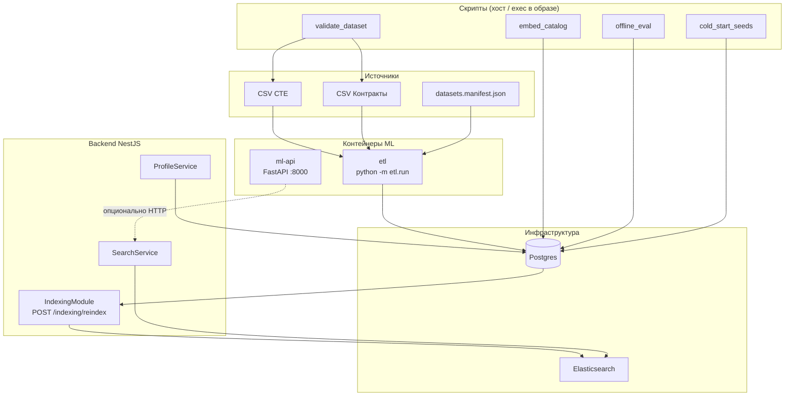
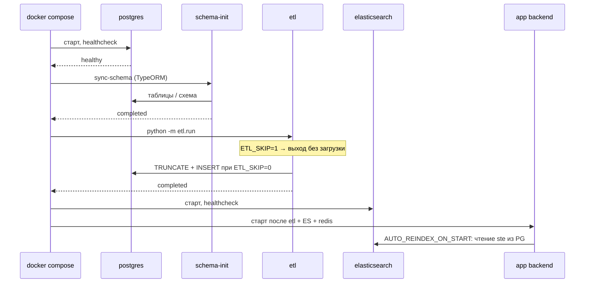
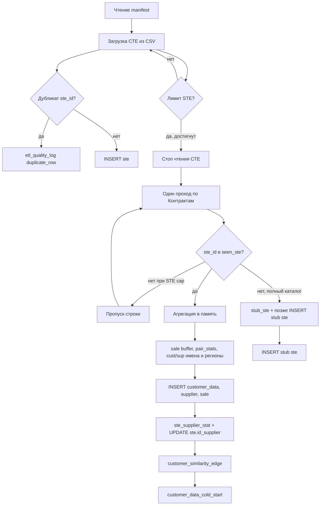
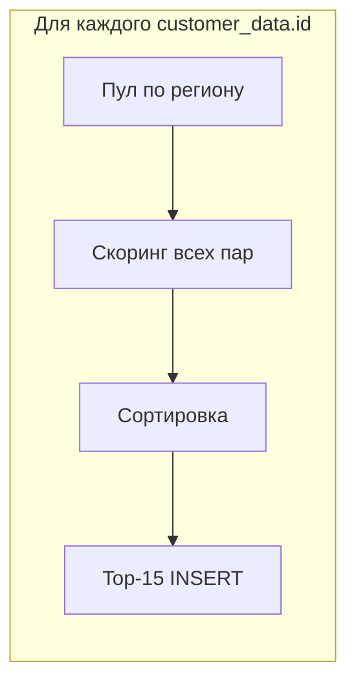
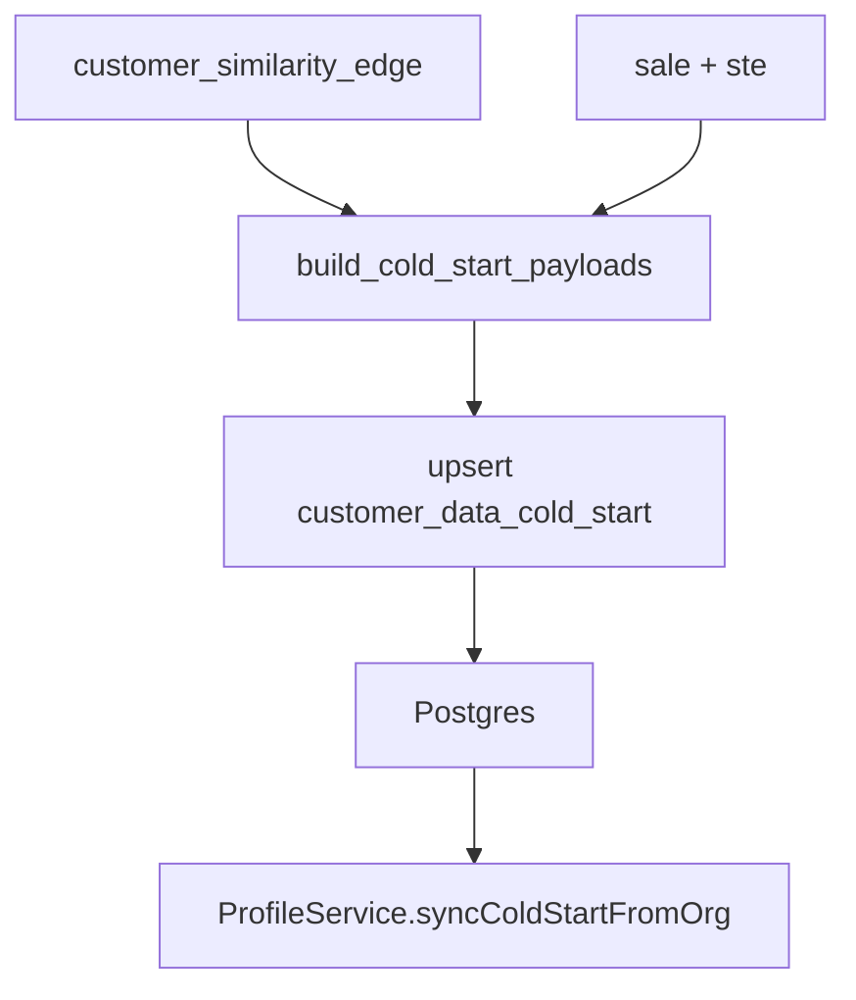
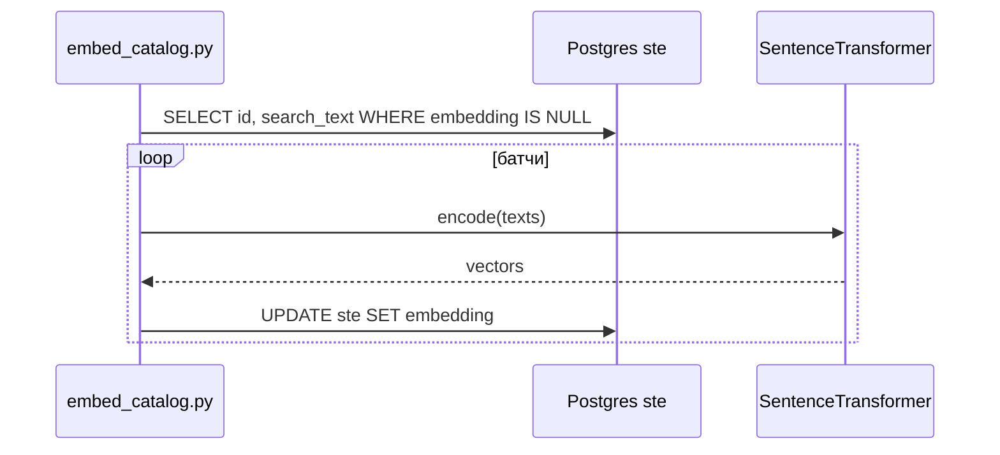

# Архитектура и реализация ML (`intelligent-ai-search/ml`)

Документ описывает, как устроены задачи из ТЗ (ETL СТЕ и контрактов, качество данных, похожие организации, эмбеддинги, cold-start, вспомогательные скрипты), какие переменные окружения влияют на поведение и как ML стыкуется с Postgres, Docker и backend.

---

## 1. Общая карта компонентов

**Легенда:** сплошные стрелки — основной поток данных; пунктир — интеграция, заложенная в ТЗ, но не обязательно вызываемая из `SearchService` на каждый запрос.

---

## 2. Запуск в Docker: порядок и зависимости

- **`schema-init`** собирается из **backend** и применяет схему БД до ETL, чтобы таблицы `ste`, `sale`, `etl_quality_log` и т.д. существовали.
- Сервис **`etl`** одноразовый (`restart: 'no'`): контейнер завершается после прогона. **`app`** ждёт `etl: condition: service_completed_successfully` — при падении ETL backend не поднимется.
- **`ml-api`** в профиле `ml`: `docker compose --profile ml up -d ml-api`.

Тома данных по умолчанию: **`DOCKER_VOLUME_ROOT`** → `D:/docker-data/intelligent-ai-search` для Postgres и Elasticsearch (см. корневой `docker-compose.yml`).

---

## 3. ETL: `python -m etl.run` (`etl/run.py`)

### 3.1. Входы

| Переменная | Назначение |
|------------|------------|
| `DATA_DIR` | Каталог с CSV (в Docker: `/data` ← `./ml/data`) |
| `MANIFEST_PATH` | JSON с именами файлов (`entity`: СТЕ, Контракты) |
| `ETL_SKIP` | `1` / `true` — выход без изменений БД |
| `ETL_CONTRACT_LIMIT` | Пусто или `0` — без лимита; иначе максимум **принятых** строк продаж |
| `ETL_STE_LIMIT` | Пусто или `0` — весь каталог СТЕ; иначе первые **N** уникальных `ste_id` по файлу |

При заданном `ETL_STE_LIMIT` контракты с `ste_id`, которого нет в загруженном каталоге, **пропускаются** (без stub-строк в `ste`), чтобы не раздувать БД «фиктивными» СТЕ.

### 3.2. Поток обработки (логический)

### 3.3. Парсинг полей

- **СТЕ:** разделитель `;`, кодировка `utf-8-sig`, колонки: id, наименование, категория, сырой текст атрибутов. Атрибуты парсятся в JSONB (`ключ:значение` внутри ячейки, части через `;`).
- **Контракты:** минимум 11 колонок; даты через `parse_dt` (несколько форматов), суммы через `parse_amount` (запятая/точка).
- **`search_text` для СТЕ:** конкатенация названия, категории и сырого блока атрибутов — используется для лексического оффлайн-оценщика и для `embed_catalog`.

### 3.4. Таблицы, которые заполняет ETL

| Таблица | Содержимое |
|---------|------------|
| `ste` | Каталог + при полном режиме — stub для СТЕ только из контрактов |
| `customer_data` | По ИНН заказчика: лучшее имя, нормализованное имя, регион, `org_type_primary` / `org_type_tags`, варианты имён |
| `supplier` | По ИНН поставщика: имя, регион, варианты |
| `sale` | Строка контракта: связь СТЕ–заказчик–поставщик, сумма, дата, заголовок закупки |
| `ste_supplier_stat` | По паре (ste_id, supplier_id): число контрактов, сумма, первые/последние даты, ранг, флаг primary |
| `ste.id_supplier` | Основной поставщик по СТЕ: победитель сортировки по числу контрактов, сумме, датам |
| `etl_quality_log` | Проблемы качества (дубликаты СТЕ, дата контракта после cutoff) |
| `customer_similarity_edge` | Рёбра «похожий заказчик» (см. раздел 4) |
| `customer_data_cold_start` | Сид-профили cold-start (см. раздел 5) |

Перед загрузкой выполняется **`TRUNCATE ... CASCADE`** по перечисленным сущностям (включая профили и лог), чтобы прогон ETL был идемпотентным по составу данных.

### 3.5. Заказчик: тип организации и нормализация (`etl/org_type.py`)

- **`normalize_org_name`:** нижний регистр, замена `ё`→`е`, удаление типовых юр. аббревиатур (ООО, ГБУ, …), чистка пунктуации, схлопывание пробелов.
- **`infer_org_type`:** эвристики по подстрокам в названии (школа, больница, ЖКХ, …) → `org_type_primary` и список тегов `org_type_tags`.

Эти поля пишутся в `customer_data` и участвуют в бонусе «одинаковый тип организации» при расчёте похожести.

---

## 4. Похожие организации: `customer_similarity_edge` (`etl/similarity.py`)

Для каждого ИНН заказчика (`source`) в **пуле кандидатов** считается оценка сходства с другими ИНН.

**Пул кандидатов:** в основном заказчики из **того же региона**; если в регионе меньше 5 организаций — кандидаты = все заказчики из датасета.

**Признаки:**

1. **Имя:** Jaccard по множеству токенов после `normalize_org_name` (токены длины > 1).
2. **Покупки:** косинус между векторами счётчиков **категорий СТЕ** по истории `sale` (частоты закупок по категориям).
3. **Регион:** бинарный бонус, если регионы совпадают и не пустые.
4. **Тип организации:** бонус, если `org_type_primary` совпадает.

**Итоговая формула** (фрагмент логики):

\[
\text{score} = 0{,}32 \cdot \text{name} + 0{,}48 \cdot \text{purchase} + 0{,}15 \cdot \mathbb{1}_{\text{same region}} + 0{,}05 \cdot \mathbb{1}_{\text{same org type}}
\]

затем ограничение в \([0, 1]\). Для каждого источника сохраняются **до 15** лучших соседей с `score > 0`. В БД пишутся также `name_similarity`, `purchase_similarity`, JSON `features`.

---

## 5. Cold-start: `customer_data_cold_start` (`etl/cold_start_profiles.py`)

**Идея:** для организации с малым или нулевым «сигналом соседей» выдать стартовые веса категорий / производителей / поставщиков для персонализации.

1. Из `customer_similarity_edge` читаются рёбра (с фильтром `similarity_score >= min_edge_score`).
2. По `sale` + `ste` считаются гистограммы на заказчика:
   - категории СТЕ;
   - производитель (`manufacturer_name`, непустой);
   - поставщик (`supplier_id`).
3. **Агрегация по соседям:** для каждого источника берутся до 20 лучших соседей по весу ребра; гистограммы соседей суммируются с весом `similarity_score`, затем отбираются top-N ключей (по умолчанию 8 категорий, 8 производителей, 8 поставщиков).
4. Если у организации **нет** сильных соседей, но есть **собственная** история закупок — сиды строятся из **direct_history** (только свои категории).

Результат upsert-ится в `customer_data_cold_start` (JSONB-поля + `seed_source` + `updated_at`).

**Backend:** `ProfileService` читает **`customer_data_cold_start`**, а не напрямую `customer_similarity_edge`, и при bootstrap копирует сиды в профиль пользователя (`CustomerPreferenceProfile`), если профиль ещё пустой по cold-start полям.

---

## 6. Проверка CSV без БД: `python -m etl.validate_dataset`

Повторяет **те же правила** чтения СТЕ и контрактов, что и ETL (лимиты `ETL_STE_LIMIT`, `ETL_CONTRACT_LIMIT`, cutoff дат, агрегаты для sanity-check). В БД не подключается. Используется для быстрой проверки файлов и манифеста перед долгим прогоном ETL.

---

## 7. Эмбеддинги

### 7.1. Сервис `ml-api` (`api/main.py`)

- **GET `/health`** — проверка живости.
- **POST `/embed`** — тело: `{ "texts": ["...", ...] }`, ответ: `{ "dim", "vectors" }`.
- Модель по умолчанию: **`sentence-transformers/paraphrase-multilingual-MiniLM-L12-v2`** (размерность **384**, нормализация векторов включена).
- Лимит размера батча: `EMBED_MAX_BATCH` (по умолчанию 128).
- Модель кэшируется в процессе (`lru_cache` на фабрику).

### 7.2. Заполнение каталога: `scripts/embed_catalog.py`

Читает из Postgres `ste.id`, `ste.search_text`, считает эмбеддинги батчами, пишет в **`ste.embedding`** (`float8[]`). По умолчанию обновляет только строки с `embedding IS NULL` (флаг `--all-rows` пересчитывает всё).

Имеет смысл запускать **после** успешного ETL; дальше backend при **`POST /indexing/reindex`** может подтягивать вектор в документ Elasticsearch (если длина 384).

---

## 8. Оффлайн-метрики: `scripts/offline_eval.py`

Не использует Elasticsearch и ML API. Строит **лексический** ранкер: токены из `procurement_title` контракта и токены из `ste.search_text`, скор как произведение пересечения на обратные корни из размеров множеств (аналог простого TF без IDF).

- Берёт подвыборку СТЕ (`--ste-limit`, по умолчанию 12000).
- Сортирует контракты по дате, делит на train/test (`--test-ratio`), на тесте ограничение `--max-test`.
- Метрики: **HitRate@K**, **MRR@K**, **NDCG@K** (K задаётся флагами, по умолчанию 5 / 10 / 10).

Это **диагностический** baseline, а не точная копия прод-поиска.

---

## 9. Скрипт выгрузки сидов: `scripts/cold_start_seeds.py`

- Без `--write-db`: строит JSON по организациям (payload cold-start + мета из `customer_data` + число рёбер из `customer_similarity_edge`).
- С `--write-db`: повторный вызов `upsert_customer_data_cold_start` (например, после смены порогов).

---

## 10. Лёгкий reranker: `rerank/light_rerank.py`

Чистые функции: **min-max** нормализация двух списков скоров и взвешенная сумма `combine_lexical_semantic` (по умолчанию 0.55 на «семантику»), плюс сортировка id по итоговому скору. **В HTTP и в backend-поиск не подключено** — задел для второго прохода ранжирования.

---

## 11. Связка с backend (кратко)

| Артефакт ML / Postgres | Потребитель в backend |
|------------------------|------------------------|
| `ste`, в т.ч. `search_text`, `embedding` | `IndexingService.reindexAllFromSte` → документы в ES |
| `customer_data_cold_start` | `ProfileService` при bootstrap / синхронизации профиля |
| `customer_similarity_edge` | Сущность TypeORM есть; **рантайм-профиль** опирается на cold-start таблицу после ETL |
| `POST /embed` (ml-api) | Вызывать может любой клиент; **текущий `SearchService`** ходит в ES без обязательного вызова ML на каждый запрос |

---

## 12. Файлы и образы

| Путь | Роль |
|------|------|
| `Dockerfile` | Образ ETL: `requirements.txt`, `etl/`, команда `python -m etl.run` |
| `Dockerfile.api` | Образ ml-api: `requirements-ml.txt`, `api/`, uvicorn |
| `requirements.txt` | Минимум для ETL: `psycopg2-binary`, `python-dotenv` |
| `requirements-ml.txt` | FastAPI, uvicorn, sentence-transformers, torch, numpy, psycopg2 |

---

*Документ согласован с кодовой базой на момент написания; при изменении `run.py` или compose проверяйте переменные окружения и порядок сервисов в `docker-compose.yml`.*
