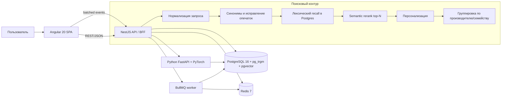
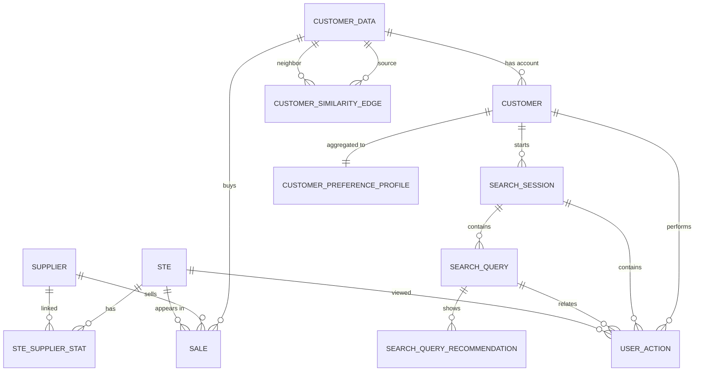
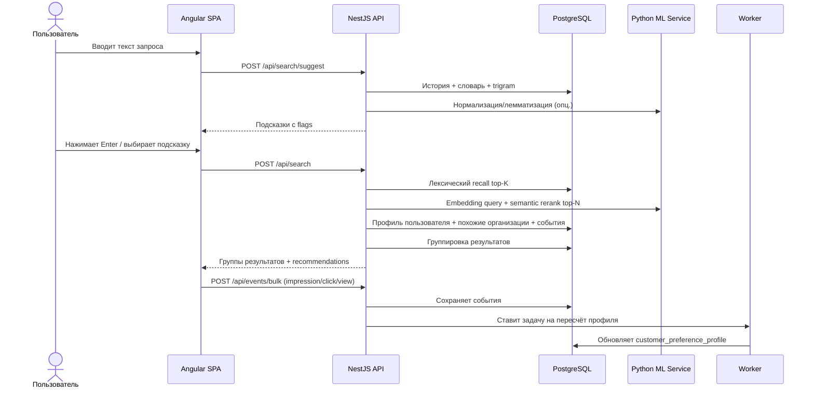
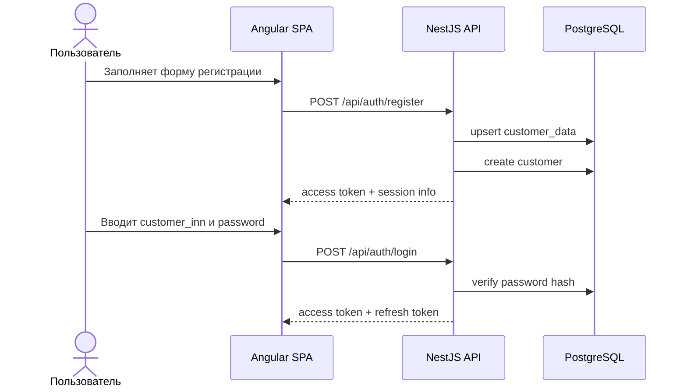
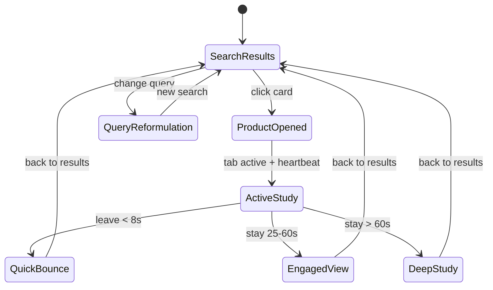
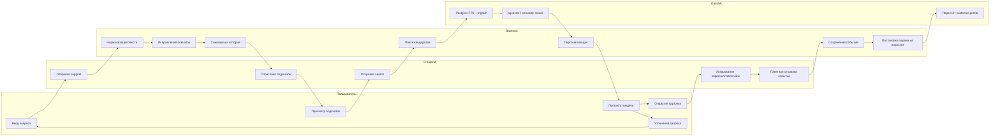

# Проектная документация

## 1. Название проекта

Персонализированный умный поиск продукции по каталогу СТЕ с динамическим ранжированием на основе истории закупок и поведения пользователя.

---

## 2. Цели проекта

Система должна:

1. Принимать поисковый запрос по СТЕ и возвращать персонализированную выдачу.
2. Учитывать историю закупок заказчика и его текущее поведение в поиске.
3. Исправлять опечатки, учитывать синонимы и показывать рекомендации в выпадающем списке.
4. Давать валидные рекомендации даже при первом входе за счёт похожих организаций.
5. Работать полностью на инфраструктуре команды, без внешних API.
6. Масштабироваться и обновлять индекс по мере накопления действий пользователя.

---

## 3. Ключевые ограничения из ТЗ

1. Linux-совместимое развертывание.
2. Веб-интерфейс обязателен.
3. Нельзя использовать внешние поисковые API и внешние LLM API.
4. Допустимы только self-hosted/open-source модели и локальные сервисы.
5. Предпочтительны легковесные технологии и быстрый инференс.

---

## 4. Факты по исходным данным

Анализ выполнен Python-скриптом [`scripts/analyze_datasets.py`](/c:/Users/OLEG/OneDrive/Рабочий%20стол/Новая%20папка%20(2)/scripts/analyze_datasets.py). Результат сохранён в [`analysis_summary.json`](/c:/Users/OLEG/OneDrive/Рабочий%20стол/Новая%20папка%20(2)/analysis_summary.json).

### 4.1 Контракты

- Строк в `Контракты_20260403.csv`: 2 010 224.
- Уникальных `contract_id`: 653 615.
- Уникальных `ste_id`: 498 370.
- Уникальных `customer_inn`: 4 192.
- Уникальных `supplier_inn`: 881.
- `contract_id` не является уникальным идентификатором строки продажи: 198 383 контрактов имеют более одной строки, максимум 330 строк на один `contract_id`.
- Минимальная дата контракта: `2014-04-07`.
- Максимальная дата контракта: `2026-12-25`.
- Найдено 6 дат позже даты выгрузки `2026-04-03`; это нужно считать аномалией источника и логировать при загрузке.

### 4.2 Каталог СТЕ

- Строк в `СТЕ_20260403.csv`: 542 993.
- Уникальных `ste_id`: 537 314.
- Дубликатов строк по `ste_id`: 5 679.
- Уникальных категорий: 6 506.
- У `ste_id` нет конфликтов по `name` и `category`; дубликаты, вероятно, являются повторными строками.

### 4.3 Качество JOIN по `ste_id`

- Пересечение `Контракты.ste_id` и `СТЕ.ste_id`: 496 809.
- `ste_id`, которые есть только в контрактах: 1 561.
- `ste_id`, которые есть только в каталоге: 40 505.

Вывод:

1. Для полной ссылочной целостности нельзя ограничиваться только каталогом СТЕ. Нужно создавать stub-записи для `ste_id`, присутствующих только в контрактах.
2. В поиске должно участвовать и множество СТЕ без истории продаж, иначе каталог будет урезан.

### 4.4 Связь `ste_id -> supplier_inn`

- `ste_id` с ровно одним поставщиком: 333 898.
- `ste_id` с несколькими поставщиками: 164 472.
- Максимум поставщиков на один `ste_id`: 65.

Вывод:

1. Поле `ste.id_supplier` может существовать только как вычисляемый `primary_supplier_id`, а не как истинная бизнес-кардинальность.
2. Обязательно нужна дополнительная таблица связи `ste_supplier_stat`, иначе будут потеряны факты по реальным поставщикам.

### 4.5 Качество сущностей по ИНН

- У заказчиков 17 ИНН имеют несколько вариантов наименований.
- У поставщиков 9 ИНН имеют несколько вариантов наименований.
- У поставщиков 4 ИНН имеют несколько регионов.

Вывод:

1. Нужна канонизация имени и региона.
2. Нужно хранить исходные варианты имён в `jsonb` для трассировки и аудита качества данных.

### 4.6 Признаки производителя в `attributes`

- `ste` с любыми manufacturer-like ключами: 79 215.
- `ste` с явными полями бренда/производителя: 30 525.
- `ste` только со страной происхождения: 27 578.

Вывод:

1. Для большинства СТЕ производитель не задан явно.
2. Группировка строго по производителю возможна только с уровнями уверенности:
   - `manufacturer_attr` — явный производитель/бренд найден в атрибутах.
   - `brand_from_name` — бренд извлечён из имени по словарю.
   - `supplier_fallback` — используем вычисленного primary supplier как замену, если производитель отсутствует.
   - `family_cluster` — fallback-кластер по семейству товара, если производитель не восстановлен.

---

## 5. Рекомендуемый стек

| Слой | Технологии | Обоснование |
|---|---|---|
| Frontend | Angular 20, Standalone, NgRx Store/Effects/Entity | Соответствует заданному стеку, достаточно для SPA с формами, поиском и состоянием выдачи |
| Backend API / BFF | Node.js 22, NestJS 11 | Соответствует выбранному стеку, подходит для модульного REST API, фоновых задач и интеграции с ML-сервисом |
| Основная БД | PostgreSQL 16 в Docker | Основа транзакционных данных, событий и профилей |
| Расширения Postgres | `pg_trgm`, `unaccent`, `pgcrypto`, `pgvector`, `btree_gin` | Нужны для поиска, исправления опечаток, токенов, векторов и индексов |
| ML / NLP сервис | Python 3.11, FastAPI, PyTorch, `sentence-transformers`, `pymorphy3` | Лёгкий локальный сервис для эмбеддингов, нормализации и переобучения |
| Очереди/фоновые задачи | Redis 7 + BullMQ | Более привычный стек для NestJS, проще для фоновых задач, повторных попыток и очередей пересчёта |
| ETL / аналитика | Python-скрипты | Соответствует требованию анализа датасета |
| Буферизация клиентских событий | `sendBeacon` + batch POST + optional `localStorage` queue | Достаточно без PWA и service worker |

### 5.1 Важное замечание по NestJS

Стек `Angular + NestJS backend` хорошо подходит под задачу хакатона. Рекомендуемая роль NestJS:

1. REST API / BFF.
2. Аутентификация и управление сессиями.
3. Обработчики поиска, подсказок и событий.
4. Планировщики, воркеры и интеграция с Python ML service.
5. Внутренние admin/debug endpoints при необходимости.

Рекомендуемая модульная структура NestJS:

1. `AuthModule`
2. `CustomerModule`
3. `SearchModule`
4. `SuggestionModule`
5. `TelemetryModule`
6. `ProfileModule`
7. `DictionaryModule`
8. `AdminModule`

Рекомендуемый инфраструктурный слой NestJS:

1. `@nestjs/config`
2. `@nestjs/jwt`
3. `Passport`
4. `Class Validator`
5. `BullMQ`
6. `Prisma` либо `TypeORM`

---

## 6. Целевая архитектура



### 6.1 Основные сервисы

1. `frontend-app`
   - Регистрация.
   - Вход.
   - Поиск.
   - Простая пакетная отправка действий пользователя.

2. `api-bff`
   - Auth API.
   - Search API.
   - Suggest API.
   - Events API.
   - Admin/debug API.

3. `postgres`
   - Справочники.
   - История продаж.
   - Профили пользователей.
   - События.
   - Поисковые индексы.

4. `ml-service`
   - Нормализация текста.
   - Генерация эмбеддингов.
   - Переиндексация векторов.
   - Экспериментальный reranker.

5. `worker`
   - BullMQ consumer.
   - Агрегация событий.
   - Пересчёт похожих организаций и cold-start seed profiles.
   - Пересчёт пользовательских профилей.
   - Перестройка персональных весов.
   - Обновление materialized views.

6. `redis`
   - Очереди фоновых задач.
   - Retriable jobs.
   - Краткоживущий кэш suggestions/search fragments при необходимости.

---

## 7. Модель данных PostgreSQL

Ниже описана рекомендованная схема. Она включает обязательные таблицы из запроса пользователя и дополнительные служебные таблицы, без которых полноценно реализовать персонализированный поиск нельзя.

### 7.1 Таблица `customer_data`

Справочник заказчиков, пришедший из исторических контрактов.

| Поле | Тип | Назначение |
|---|---|---|
| `id` | `varchar(12)` PK | `customer_inn` |
| `customer_name` | `text` | Каноническое имя заказчика |
| `customer_name_normalized` | `text` | Нормализованное имя без юр. формы и стоп-слов |
| `customer_region` | `text` | Канонический регион |
| `org_type_primary` | `varchar(64) null` | Основной тип организации: `school`, `clinic`, `hospital`, `college`, `library`, `housing`, ... |
| `org_type_tags` | `text[]` | Набор выявленных тегов типа организации |
| `name_embedding` | `vector(384) null` | Эмбеддинг названия организации для поиска похожих заказчиков |
| `name_variants` | `jsonb` | Исходные варианты имени |
| `source_first_seen_at` | `timestamptz` | Первая дата контракта |
| `source_last_seen_at` | `timestamptz` | Последняя дата контракта |
| `created_at` | `timestamptz` | Техническое поле |
| `updated_at` | `timestamptz` | Техническое поле |

Правило:

- `id = customer_inn`.

### 7.2 Таблица `customer`

Таблица учётных записей для входа в систему.

| Поле | Тип | Назначение |
|---|---|---|
| `id` | `uuid` PK | Идентификатор учётной записи |
| `customer_data_id` | `varchar(12)` FK -> `customer_data.id` | Привязка к заказчику |
| `login` | `varchar(12)` UNIQUE | Равен `customer_inn` |
| `password_hash` | `text` | Argon2id/Bcrypt hash |
| `status` | `varchar(32)` | `active`, `blocked`, `pending` |
| `created_at` | `timestamptz` | Дата регистрации |
| `last_login_at` | `timestamptz` | Последний вход |

Жёсткое правило:

- `login = customer_data_id = customer_inn`.

### 7.3 Таблица `supplier`

Справочник поставщиков.

| Поле | Тип | Назначение |
|---|---|---|
| `id` | `varchar(12)` PK | `supplier_inn` |
| `supplier_name` | `text` | Каноническое имя |
| `supplier_region` | `text` | Канонический регион |
| `name_variants` | `jsonb` | Варианты имен |
| `region_variants` | `jsonb` | Варианты регионов |
| `source_first_seen_at` | `timestamptz` | Первая продажа |
| `source_last_seen_at` | `timestamptz` | Последняя продажа |
| `created_at` | `timestamptz` | Техническое поле |
| `updated_at` | `timestamptz` | Техническое поле |

Правило:

- `id = supplier_inn`.

### 7.4 Таблица `ste`

Нормализованный каталог СТЕ.

| Поле | Тип | Назначение |
|---|---|---|
| `id` | `varchar(32)` PK | `ste_id` |
| `name` | `text` | Наименование СТЕ |
| `category` | `text` | Категория |
| `attributes_raw` | `text` | Сырой текст атрибутов |
| `attributes_jsonb` | `jsonb` | Распарсенные атрибуты |
| `manufacturer_name` | `text null` | Вычисленный производитель/бренд |
| `manufacturer_source` | `varchar(32)` | `manufacturer_attr`, `brand_from_name`, `supplier_fallback`, `family_cluster`, `unknown` |
| `manufacturer_confidence` | `numeric(5,4)` | Доверие к `manufacturer_name` |
| `id_supplier` | `varchar(12) null` FK -> `supplier.id` | Вычисленный primary supplier |
| `supplier_resolution_method` | `varchar(32)` | `top_contracts`, `top_amount`, `latest`, `none` |
| `source_status` | `varchar(32)` | `catalog`, `contracts_stub` |
| `search_text` | `text` | Склеенный текст для индексации |
| `search_vector` | `tsvector` | FTS индекс |
| `embedding` | `vector(384) null` | Семантическое представление |
| `created_at` | `timestamptz` | Техническое поле |
| `updated_at` | `timestamptz` | Техническое поле |

### 7.5 Таблица `ste_supplier_stat`

Дополнительная обязательная таблица, потому что один `ste_id` часто связан с несколькими поставщиками.

| Поле | Тип | Назначение |
|---|---|---|
| `ste_id` | `varchar(32)` FK -> `ste.id` | СТЕ |
| `supplier_id` | `varchar(12)` FK -> `supplier.id` | Поставщик |
| `contracts_count` | `integer` | Сколько строк продаж |
| `contracts_total_amount` | `numeric(18,2)` | Общая сумма |
| `first_contract_at` | `timestamptz` | Первая продажа |
| `last_contract_at` | `timestamptz` | Последняя продажа |
| `rank_in_ste` | `integer` | Позиция поставщика для данного `ste_id` |
| `is_primary` | `boolean` | Флаг primary supplier |

Первичный ключ:

- `(ste_id, supplier_id)`.

Правило вычисления `ste.id_supplier`:

1. Считаем `contracts_count` по паре `(ste_id, supplier_id)`.
2. При равенстве берём максимальную `contracts_total_amount`.
3. При равенстве берём самый поздний `last_contract_at`.
4. При полном равенстве берём минимальный `supplier_id` для детерминированности.

### 7.6 Таблица `sale`

Факты продаж из `Контракты_20260403.csv`.

| Поле | Тип | Назначение |
|---|---|---|
| `id` | `bigserial` PK | Суррогатный идентификатор строки |
| `contract_id` | `varchar(32)` | Идентификатор контракта из источника |
| `ste_id` | `varchar(32)` FK -> `ste.id` | СТЕ |
| `customer_data_id` | `varchar(12)` FK -> `customer_data.id` | Заказчик |
| `supplier_id` | `varchar(12)` FK -> `supplier.id` | Поставщик |
| `procurement_title` | `text` | Наименование закупки |
| `contract_date` | `timestamptz` | Дата контракта |
| `contract_amount` | `numeric(18,2)` | Стоимость |
| `created_at` | `timestamptz` | Техническое поле |

Почему нужен `bigserial id`:

- `contract_id` не уникален в источнике.

### 7.7 Таблица `search_session`

Сессия работы пользователя с поиском.

| Поле | Тип | Назначение |
|---|---|---|
| `id` | `uuid` PK | Идентификатор сессии |
| `customer_id` | `uuid` FK -> `customer.id` | Пользователь |
| `started_at` | `timestamptz` | Начало |
| `finished_at` | `timestamptz null` | Окончание |
| `user_agent` | `text` | Технический контекст |
| `device_type` | `varchar(32)` | `desktop`, `tablet`, `mobile` |
| `app_version` | `varchar(32)` | Версия фронта |

### 7.8 Таблица `search_query`

История поисковых запросов.

| Поле | Тип | Назначение |
|---|---|---|
| `id` | `uuid` PK | Идентификатор запроса |
| `session_id` | `uuid` FK -> `search_session.id` | Сессия |
| `customer_id` | `uuid` FK -> `customer.id` | Пользователь |
| `original_query` | `text` | Введённый текст |
| `normalized_query` | `text` | Нормализованный текст |
| `corrected_query` | `text null` | Исправленная форма |
| `correction_applied` | `boolean` | Было ли исправление |
| `result_count` | `integer` | Сколько найдено |
| `latency_ms` | `integer` | Время ответа |
| `query_source` | `varchar(32)` | `typed`, `suggest`, `history`, `retry` |
| `created_at` | `timestamptz` | Время поиска |

### 7.9 Таблица `search_query_recommendation`

Что именно показали пользователю в автодополнении/подсказках.

| Поле | Тип | Назначение |
|---|---|---|
| `id` | `bigserial` PK | Идентификатор |
| `search_query_id` | `uuid` FK -> `search_query.id` | Запрос |
| `text` | `text` | Текст подсказки |
| `kind` | `varchar(32)` | `history`, `spellfix`, `synonym`, `popular`, `category` |
| `flags` | `text[]` | Набор признаков для фронта |
| `position` | `integer` | Порядок в списке |
| `score` | `numeric(6,4)` | Внутренний скоринг |
| `selected` | `boolean` | Была ли выбрана |
| `created_at` | `timestamptz` | Время показа |

### 7.10 Таблица `user_action`

Универсальная таблица телеметрии действий пользователя.

| Поле | Тип | Назначение |
|---|---|---|
| `id` | `bigserial` PK | Идентификатор |
| `event_id` | `uuid` UNIQUE | Idempotency ключ от фронта |
| `session_id` | `uuid` FK -> `search_session.id` | Сессия |
| `customer_id` | `uuid` FK -> `customer.id` | Пользователь |
| `search_query_id` | `uuid null` FK -> `search_query.id` | Связанный запрос |
| `ste_id` | `varchar(32) null` FK -> `ste.id` | Связанная карточка |
| `event_type` | `varchar(64)` | Тип действия |
| `event_at` | `timestamptz` | Когда произошло |
| `dwell_ms` | `integer null` | Время изучения страницы/блока |
| `active_time_ms` | `integer null` | Время при активной вкладке |
| `result_rank` | `integer null` | Позиция в выдаче |
| `page_no` | `integer null` | Номер страницы выдачи |
| `payload` | `jsonb` | Дополнительные детали |

### 7.11 Таблица `customer_preference_profile`

Агрегированный профиль пользователя для быстрого ранжирования.

| Поле | Тип | Назначение |
|---|---|---|
| `customer_id` | `uuid` PK FK -> `customer.id` | Пользователь |
| `top_categories` | `jsonb` | Веса по категориям |
| `top_manufacturers` | `jsonb` | Веса по производителям |
| `top_suppliers` | `jsonb` | Веса по поставщикам |
| `top_attributes` | `jsonb` | Веса по атрибутам |
| `cold_start_seed_categories` | `jsonb` | Стартовые категории из похожих организаций |
| `cold_start_seed_manufacturers` | `jsonb` | Стартовые бренды/производители из похожих организаций |
| `cold_start_seed_suppliers` | `jsonb` | Стартовые поставщики из похожих организаций |
| `seed_source` | `varchar(64)` | `direct_history`, `similar_organizations`, `popular_in_region`, `global_popular` |
| `negative_patterns` | `jsonb` | Негативные сигналы |
| `query_embedding_centroid` | `vector(384) null` | Семантический профиль |
| `updated_at` | `timestamptz` | Последний пересчёт |

### 7.12 Таблица `customer_similarity_edge`

Связи между похожими заказчиками для cold-start рекомендаций.

| Поле | Тип | Назначение |
|---|---|---|
| `source_customer_data_id` | `varchar(12)` FK -> `customer_data.id` | Для кого считаем похожих |
| `neighbor_customer_data_id` | `varchar(12)` FK -> `customer_data.id` | Похожий заказчик |
| `similarity_score` | `numeric(6,4)` | Итоговая близость |
| `same_region` | `boolean` | Совпадает ли регион |
| `same_org_type` | `boolean` | Совпадает ли тип организации |
| `name_similarity` | `numeric(6,4)` | Близость по названию |
| `purchase_similarity` | `numeric(6,4)` | Близость по структуре контрактов |
| `features` | `jsonb` | Детали расчёта |
| `computed_at` | `timestamptz` | Когда пересчитано |

Первичный ключ:

- `(source_customer_data_id, neighbor_customer_data_id)`.

### 7.13 Таблица `synonym_entry`

Локальный словарь синонимов и аббревиатур.

| Поле | Тип | Назначение |
|---|---|---|
| `id` | `bigserial` PK | Идентификатор |
| `canonical_term` | `text` | Каноническая форма |
| `variant_term` | `text` | Вариант / синоним / аббревиатура |
| `kind` | `varchar(32)` | `manual`, `mined`, `abbreviation` |
| `weight` | `numeric(6,4)` | Вес разворачивания |
| `is_active` | `boolean` | Используется ли запись |
| `created_at` | `timestamptz` | Техническое поле |

---

## 8. ER-диаграмма



---

## 9. UML: основные взаимодействия

### 9.1 Диаграмма последовательности: поиск



### 9.2 Диаграмма последовательности: регистрация и вход



### 9.3 Диаграмма состояний: жизненный цикл взаимодействия с карточкой товара



---

## 10. BPMN-подобная схема процесса

Эта диаграмма нужна для презентации защиты. Она оформлена в swimlane-стиле и легко переносится в BPMN-редактор.



---

## 11. Загрузка и преобразование исходных CSV

### 11.1 ETL-пайплайн

1. Загрузить CSV во временные staging-таблицы `stg_contracts` и `stg_ste`.
2. Удалить точные дубликаты по `ste_id` в `stg_ste`.
3. Распарсить `attributes` в `jsonb`.
4. Канонизировать имена заказчиков и поставщиков.
5. Нормализовать `customer_name`, извлечь `org_type_primary`, `org_type_tags`.
6. Построить `customer_data`.
7. Построить `supplier`.
8. Построить `ste` из каталога.
9. Добавить stub-СTЕ для 1 561 `ste_id`, встречающихся только в контрактах.
10. Построить `sale`.
11. Построить `ste_supplier_stat`.
12. Вычислить `ste.id_supplier`.
13. Построить `customer_similarity_edge`.
14. Построить индексы поиска, эмбеддинги и cold-start seed profiles.

### 11.2 Правила канонизации

1. `customer_inn` и `supplier_inn` хранить строкой.
2. ИНН не преобразовывать в integer, чтобы не потерять формат.
3. `customer_name` и `supplier_name` канонизировать по наиболее частому варианту.
4. Для `customer_name` хранить нормализованную форму без юр. форм и стоп-слов.
5. Извлекать тип организации через словарь правил и regex-шаблоны.
6. Если у поставщика несколько регионов, брать наиболее частый и хранить все варианты в `region_variants`.
7. Все аномалии грузить в таблицу `etl_quality_log`.

### 11.3 Отдельная таблица качества загрузки

Рекомендуется служебная таблица `etl_quality_log`:

| Поле | Тип | Назначение |
|---|---|---|
| `id` | `bigserial` PK | Идентификатор |
| `batch_id` | `uuid` | Пакет загрузки |
| `source_name` | `text` | Источник |
| `entity_name` | `text` | Сущность |
| `entity_key` | `text` | Ключ записи |
| `issue_code` | `text` | Тип проблемы |
| `issue_payload` | `jsonb` | Детали |
| `created_at` | `timestamptz` | Время |

---

## 12. Индексация и поиск

### 12.1 Что индексируем

В `ste.search_text` объединяются:

1. `name`
2. `category`
3. ключи и значения из `attributes_jsonb`
4. канонический `manufacturer_name`
5. частотные формулировки из `procurement_title` по этому `ste_id` при необходимости

### 12.2 Индексы

1. `GIN(search_vector)` для полнотекстового поиска.
2. `GIN(name gin_trgm_ops)` для опечаток и prefix-match.
3. `HNSW/IVFFLAT` по `embedding` для семантического поиска.
4. `BTREE(category)`.
5. `BTREE(id_supplier)`.
6. `GIN(attributes_jsonb)` для фильтрации по атрибутам.

### 12.3 Алгоритм поиска

#### Шаг 1. Нормализация

1. Привести текст к нижнему регистру.
2. Заменить `ё` на `е`.
3. Схлопнуть повторяющиеся пробелы.
4. Выделить числовые токены и единицы измерения.
5. Применить словарь сокращений.

#### Шаг 2. Подсказки и исправления

1. Проверить историю запросов пользователя.
2. Проверить словарь синонимов и аббревиатур.
3. Для неизвестных токенов подобрать исправления через `pg_trgm`.
4. Не исправлять числа, артикулы и короткие технические обозначения без подтверждения.

#### Шаг 3. Лексический recall

1. Найти top-K кандидатов через `search_vector`.
2. Добавить кандидатов по trigram similarity.
3. Добавить кандидатов по точному совпадению атрибутов.

#### Шаг 4. Семантический rerank

1. Построить embedding запроса.
2. Пересчитать близость к embedding кандидатов.
3. Переранжировать top-N.

#### Шаг 5. Персонализация

1. Подмешать историю закупок пользователя.
2. Если пользователь новый или у него мало истории, подмешать cold-start prior по похожим организациям.
3. Подмешать affinity по категориям, атрибутам, производителям и поставщикам.
4. Подмешать поведенческие сигналы из текущей и прошлых сессий.
5. Ограничить вклад персонализации, чтобы не ломать релевантность.

#### Шаг 6. Группировка по производителю

1. Сначала группировать по `manufacturer_name`, если `manufacturer_confidence >= 0.75`.
2. Если явного производителя нет, использовать `brand_from_name`.
3. Если и этого нет, использовать `supplier_fallback`, но явно помечать источник.
4. Если и это невозможно, собирать `family_cluster` по категории + нормализованным токенам имени.

---

## 13. Алгоритм группировки по производителю

Из-за неполноты данных предлагается не одна, а четырёхуровневая схема.

### 13.1 Формирование `manufacturer_name`

Приоритет:

1. Явные атрибуты:
   - `Производитель`
   - `Бренд`
   - `Торговая марка`
   - `Марка`
   - `Товарный знак производителя оргтехники`

2. Извлечение бренда из имени СТЕ:
   - по словарю брендов;
   - по частотным uppercase/latin токенам;
   - по устойчивым шаблонам в начале названия.

3. Fallback на `primary_supplier_id`.

4. Fallback на `family_cluster`.

### 13.2 Формирование `family_cluster`

`family_cluster_key` строится из:

1. нормализованной категории;
2. лемм основного имени;
3. исключения чисел, единиц измерения и вариативных атрибутов;
4. ключевых атрибутов, которые задают семейство, а не вариант.

Пример:

- `Резистор ABC 1 Ом`
- `Резистор ABC 2 Ом`
- `Резистор ABC 3 Ом`

Общий `family_cluster_key`:

- `резистор|abc|category:резисторы`

Варианты внутри группы:

- `1 Ом`
- `2 Ом`
- `3 Ом`

### 13.3 Почему так лучше

1. Не ломается поиск в категориях, где производителя нет явно.
2. Можно однозначно определить, за счёт какого источника сформирована группа:
   - по реальному бренду;
   - по бренду из названия;
   - по поставщику;
   - по товарному семейству.

---

## 14. Персонализация и "обучаемость" поиска

### 14.1 Принцип

Персонализация строится в двух контурах:

1. `offline-contract contour`:
   - опирается на историю контрактов;
   - проверяется на предоставленном датасете;
   - является основным формальным benchmark для защиты.

2. `online-behavior contour`:
   - опирается на реальные действия пользователя в поиске;
   - нужен для демонстрации "дообучения" между сессиями;
   - показывает комиссии, что два одинаковых запроса одного и того же пользователя могут давать разную выдачу после новых сигналов.

Дополнительно нужен `cold-start contour` для первого входа:

1. если у пользователя есть исторические контракты по `customer_inn`, используем их сразу;
2. если исторических контрактов нет или их мало, строим начальный профиль по похожим организациям;
3. похожесть определяется по названию организации, типу организации, региону и контрактному профилю ближайших соседей из датасета.

### 14.2 Cold-start по названию организации и похожим заказчикам

Алгоритм cold-start:

1. Нормализовать `customer_name`:
   - убрать юр. формы;
   - убрать стоп-слова;
   - привести к базовой форме;
   - сохранить ключевые токены.
2. Определить `org_type_primary` и `org_type_tags`:
   - школа;
   - детский сад;
   - поликлиника;
   - больница;
   - колледж;
   - университет;
   - библиотека;
   - жилищно-коммунальная организация;
   - и другие типы по словарю правил.
3. Построить `name_embedding` по нормализованному названию организации.
4. Найти ближайших заказчиков в `customer_similarity_edge` по формуле:

```text
org_similarity =
  0.40 * org_type_match +
  0.25 * region_match +
  0.20 * customer_name_embedding_similarity +
  0.15 * purchase_profile_similarity
```

5. Собрать top-K похожих заказчиков.
6. Агрегировать их закупки:
   - топ-категории;
   - топ-атрибуты;
   - топ-производителей;
   - топ-поставщиков;
   - частотные СТЕ.
7. Сформировать стартовый профиль пользователя в `customer_preference_profile` с `seed_source = similar_organizations`.

Принцип работы:

1. На первом входе пользователь ещё ничего не искал на платформе.
2. Но по названию организации можно понять её тип.
3. По типу и региону можно найти похожих заказчиков.
4. Их история закупок используется как prior для рекомендаций и ранжирования.

### 14.3 Контрактные позитивные сигналы

| Сигнал | Правило | Эффект |
|---|---|---|
| `purchase_same_ste` | Пользователь раньше закупал этот `ste_id` | Сильный boost |
| `purchase_same_category` | Повторяющиеся закупки в той же категории | Средний boost |
| `purchase_same_manufacturer` | История по тому же бренду/производителю | Средний boost |
| `purchase_same_supplier` | Повторные закупки у того же поставщика | Небольшой boost |
| `purchase_same_attributes` | Часто встречающиеся атрибуты в истории заказчика | Средний boost |
| `recent_purchase_match` | Сходство с недавними контрактами заказчика | Средний boost |
| `similar_org_category` | Похожим организациям часто нужна эта категория | Средний boost для cold-start |
| `similar_org_supplier` | Похожие организации часто закупают у этого поставщика | Небольшой boost |
| `similar_org_manufacturer` | Похожие организации часто выбирают этот бренд | Небольшой boost |

### 14.4 Контрактные негативные сигналы

| Сигнал | Правило | Эффект |
|---|---|---|
| `stale_purchase_pattern` | Очень старые закупки без повторов | Лёгкий penalty через decay |
| `supplier_drift` | Заказчик перестал закупать у этого поставщика | Лёгкий penalty |
| `category_drift` | Категория давно не закупалась | Лёгкий penalty |
| `weak_neighbor_signal` | Сигнал похожих организаций слишком слабый и размытый | Снижение веса cold-start prior |

### 14.5 Поведенческие сигналы для online-переобучения

| Сигнал | Правило | Эффект |
|---|---|---|
| `long_product_view` | Активный просмотр карточки > 45 сек | Небольшой boost группе/семейству |
| `deep_product_view` | Просмотр > 60 сек | Средний boost |
| `repeat_product_view` | Повторное открытие той же карточки или группы | Boost |
| `suggestion_selected` | Пользователь выбрал подсказку | Boost типу подсказки и близким запросам |
| `quick_bounce` | Открытие карточки и возврат < 8 сек | Заметный penalty |
| `short_view_then_reformulate` | Короткий просмотр и новый запрос | Лёгкий penalty группе |
| `results_no_click_reformulate` | Просмотр выдачи без кликов и смена запроса | Лёгкий penalty исходной ветке выдачи |

### 14.6 Мягкость корректировок

Персонализация должна быть аккуратной. Нельзя резко "ломать" выдачу.

Правило:

- вклад контрактной персонализации ограничивается диапазоном `[-0.20; +0.20]`;
- вклад cold-start контура по похожим организациям ограничивается диапазоном `[-0.10; +0.10]`;
- вклад поведенческого контура на одну сессию ограничивается диапазоном `[-0.12; +0.12]`;
- общий прирост/штраф за одну итерацию дообучения должен быть плавным и монотонным.

### 14.7 Формула ранжирования

Рабочая формула ранжирования:

```text
final_score =
  0.38 * lexical_score +
  0.15 * semantic_score +
  0.16 * purchase_affinity +
  0.08 * org_similarity_affinity +
  0.10 * behavior_affinity +
  0.05 * supplier_affinity +
  0.08 * category_attribute_affinity
```

Где:

- `lexical_score` — совпадение по тексту, морфологии, атрибутам;
- `semantic_score` — близость embedding;
- `purchase_affinity` — история контрактов пользователя;
- `org_similarity_affinity` — стартовый prior по похожим организациям;
- `behavior_affinity` — сигналы взаимодействия из текущей и прошлых сессий;
- `supplier_affinity` — склонность к определённым поставщикам;
- `category_attribute_affinity` — совпадение с предпочитаемыми категориями и атрибутами заказчика.

Правило использования:

1. В offline-проверке по контрактам `behavior_affinity = 0`.
2. В cold-start проверке `purchase_affinity` может быть равен `0`, а `org_similarity_affinity` становится основным персональным сигналом.
3. В live/demo-сценариях `behavior_affinity` включается сразу после поступления событий и пересчёта профиля.

### 14.8 Session-level дообучение

Чтобы две одинаковые сессии одного пользователя давали разную выдачу, нужен быстрый feedback loop:

1. Пользователь выполняет запрос `q`.
2. Открывает карточку/группу товара.
3. Система получает `product_view_start`, `heartbeat`, `product_view_end`, `query_reformulation`.
4. NestJS кладёт задачу в BullMQ.
5. Worker обновляет:
   - `customer_preference_profile`;
   - краткоживущий `session_feedback_profile`.
6. При следующем таком же запросе:
   - повышаются группы, связанные с длинным просмотром;
   - понижаются позиции с быстрым возвратом.

### 14.9 Time decay

Старые покупки должны постепенно терять вес:

```text
time_weight = exp(-days_since_event / 365)
```

Для очень старых закупок можно использовать два режима:

1. мягкое затухание для повторяющихся категорий;
2. более сильное затухание для точных SKU/STE.

---

## 15. Метрики качества: offline по контрактам и online по поведению

Ниже два набора метрик:

1. оффлайн-метрики по контрактам для формальной проверки качества;
2. online/demo-метрики по поведению для доказательства адаптации между сессиями.

### 15.1 Offline ranking-метрики по контрактам

1. `HitRate@k` — попал ли реально закупленный `ste_id` в top-k.
2. `Recall@k` — какая доля целевых закупок попала в top-k.
3. `MRR@k` — насколько высоко находится первая релевантная позиция.
4. `NDCG@k` — качество ранжирования с учётом позиции релевантных результатов.
5. `MAP@k` — средняя точность по всем тестовым запросам.

### 15.2 Offline-метрики персонализации по контрактной истории

1. `Repeat STE HitRate@k` — способен ли поиск вернуть уже закупавшийся `ste_id`.
2. `Same Category HitRate@k` — попадает ли в top-k нужная категория.
3. `Same Manufacturer HitRate@k` — попадает ли производитель/бренд из истории заказчика.
4. `Same Supplier HitRate@k` — попадает ли поставщик, с которым заказчик реально работал.
5. `Attribute Match Rate@k` — совпадают ли ключевые атрибуты закупки с top-k результатами.

### 15.3 Offline-метрики cold-start по похожим организациям

1. `Org-Type HitRate@k` — возвращает ли поиск категории, типичные для организаций такого типа.
2. `Similar Organization HitRate@k` — попадают ли в top-k позиции, характерные для ближайших похожих заказчиков.
3. `Cold-start NDCG@k` — качество ранжирования, если для пользователя использовать только название организации, регион и соседей.
4. `Neighbor Purchase Recovery@k` — восстанавливаются ли реальные закупки пользователя через профиль похожих организаций.
5. `Cold-start Coverage` — для какой доли новых пользователей удаётся построить seed-профиль.

### 15.4 Online/demo-метрики поведенческой адаптации

1. `Repeat Query Rank Shift` — насколько меняется позиция группы после новых поведенческих сигналов при том же запросе.
2. `Positive Signal Promotion Rate` — доля случаев, когда товары с длинным просмотром поднимаются выше в следующей сессии.
3. `Negative Signal Demotion Rate` — доля случаев, когда товары с быстрым возвратом опускаются ниже.
4. `Session Adaptation Latency` — время от прихода события до изменения выдачи.

### 15.5 Метрики полноты и устойчивости

1. `Catalog Coverage@k` — насколько широкий слой каталога реально участвует в выдаче.
2. `Customer Coverage` — для какой доли заказчиков персонализация вообще срабатывает.
3. `Cold-start Success Rate` — качество на заказчиках с короткой историей закупок.
4. `Long-tail Category Recall@k` — качество в редких категориях.

### 15.6 Протокол оффлайн-проверки

1. Делить данные по времени: ранние контракты в train, более поздние в validation/test.
2. Для каждого `customer_inn` скрывать последние 1..N закупок и пытаться восстановить их поиском.
3. Использовать `procurement_title` и нормализованный `ste.name` как тестовые запросы.
4. Отдельно считать метрики для:
   - frequent customers;
   - cold-start customers;
   - частых категорий;
   - редких категорий.

### 15.7 Протокол offline-проверки cold-start по организации

1. Для тестового заказчика скрыть его собственную контрактную историю.
2. Оставить только:
   - `customer_name`;
   - `customer_region`;
   - словарь типов организаций;
   - историю похожих заказчиков.
3. Построить `org_similarity_affinity` через похожие организации.
4. Выполнить поиск по тестовым запросам.
5. Сравнить:
   - baseline без cold-start;
   - cold-start по похожим организациям;
   - cold-start + semantic rerank.

### 15.8 Протокол demo-проверки поведения

1. Создать тестового пользователя с историей контрактов.
2. Выполнить запрос `Q1` и сохранить baseline-выдачу.
3. В первой сессии:
   - долго изучить одну группу товаров;
   - быстро выйти из другой группы;
   - переформулировать запрос.
4. Дождаться пересчёта профиля через BullMQ.
5. Во второй сессии повторить тот же запрос `Q1`.
6. Зафиксировать:
   - какие группы поднялись;
   - какие группы опустились.

### 15.9 Что показывать на защите

1. Сравнение `baseline lexical` против `lexical + personalization`.
2. Сравнение `baseline lexical` против `lexical + cold-start by similar organizations`.
3. Сравнение `lexical + personalization` против `lexical + personalization + semantic rerank`.
4. Таблицу `HitRate@5`, `MRR@10`, `NDCG@10`, `Same Category HitRate@10`, `Cold-start NDCG@10`.
5. Кейс первого входа, где организация без истории на платформе получает рекомендации по похожим заказчикам.
6. Кейс `Session A vs Session B` для одного пользователя и одного запроса.
7. Изменение позиций после длинного просмотра и после быстрого возврата.

---

## 16. Формат запросов между фронтом и беком

### 16.1 Регистрация

`POST /api/auth/register`

```json
{
  "customer_inn": "7701234567",
  "customer_name": "ГБУ Пример",
  "customer_region": "Москва",
  "password": "StrongPassword123!"
}
```

Ответ:

```json
{
  "customer_id": "7f76d7db-4e58-44a6-b780-8f2d827c8f3b",
  "customer_data_id": "7701234567",
  "login": "7701234567",
  "access_token": "jwt",
  "refresh_token": "jwt"
}
```

### 16.2 Вход

`POST /api/auth/login`

```json
{
  "customer_inn": "7701234567",
  "password": "StrongPassword123!"
}
```

Ответ:

```json
{
  "customer_id": "7f76d7db-4e58-44a6-b780-8f2d827c8f3b",
  "customer_data_id": "7701234567",
  "login": "7701234567",
  "access_token": "jwt",
  "refresh_token": "jwt"
}
```

### 16.3 Подсказки при вводе

`POST /api/search/suggest`

```json
{
  "session_id": "f29f98d2-1178-4e50-bd08-d7c4bd6a5f13",
  "query": "резистар 3 ом",
  "limit": 10,
  "include_history": true,
  "include_spellfix": true,
  "include_synonyms": true
}
```

Ответ:

```json
{
  "query": "резистар 3 ом",
  "normalized_query": "резистар 3 ом",
  "items": [
    {
      "text": "резистор 3 ом",
      "kind": "spellfix",
      "flags": ["TYPO_CORRECTION", "CAN_REPLACE_QUERY"],
      "score": 0.96
    },
    {
      "text": "резистор 3 ом smd",
      "kind": "history",
      "flags": ["FROM_HISTORY", "PERSONALIZED"],
      "score": 0.83
    },
    {
      "text": "сопротивление 3 ом",
      "kind": "synonym",
      "flags": ["SYNONYM_EXPANSION"],
      "score": 0.72
    }
  ]
}
```

### 16.4 Поиск

`POST /api/search`

```json
{
  "session_id": "f29f98d2-1178-4e50-bd08-d7c4bd6a5f13",
  "query": "резистар 3 ом",
  "page": 1,
  "page_size": 20,
  "group_by": "manufacturer",
  "sort": "personalized",
  "filters": {
    "category": ["Резисторы"],
    "supplier_region": ["Москва"]
  }
}
```

Ответ:

```json
{
  "query_id": "29fef2dc-a328-4d1a-83fe-8bdde7ebd345",
  "original_query": "резистар 3 ом",
  "normalized_query": "резистар 3 ом",
  "corrected_query": "резистор 3 ом",
  "corrections": [
    {
      "text": "резистор 3 ом",
      "flags": ["TYPO_CORRECTION", "APPLIED"]
    }
  ],
  "recommendations": [
    {
      "text": "резистор 3 ом smd",
      "kind": "history",
      "flags": ["FROM_HISTORY", "PERSONALIZED"]
    },
    {
      "text": "сопротивление 3 ом",
      "kind": "synonym",
      "flags": ["SYNONYM_EXPANSION"]
    }
  ],
  "groups": [
    {
      "group_key": "brand:abc|family:resistor",
      "group_title": "ABC",
      "group_type": "manufacturer_attr",
      "manufacturer_confidence": 0.94,
      "collapsed_variants_count": 3,
      "score": 0.8812,
      "items": [
        {
          "ste_id": "1234567",
          "name": "Резистор ABC 1 Ом",
          "category": "Резисторы",
          "supplier_id": "7701234567",
          "score": 0.8812,
          "attributes": {
            "Сопротивление": "1 Ом"
          }
        },
        {
          "ste_id": "1234568",
          "name": "Резистор ABC 2 Ом",
          "category": "Резисторы",
          "supplier_id": "7701234567",
          "score": 0.8574,
          "attributes": {
            "Сопротивление": "2 Ом"
          }
        }
      ]
    }
  ],
  "pagination": {
    "page": 1,
    "page_size": 20,
    "total_groups": 137
  }
}
```

### 16.5 Приём событий с фронта

`POST /api/events/bulk`

```json
{
  "session_id": "f29f98d2-1178-4e50-bd08-d7c4bd6a5f13",
  "events": [
    {
      "event_id": "44efc5fa-7e54-4f70-a5fe-f9f7825298e7",
      "event_type": "search_results_impression",
      "search_query_id": "29fef2dc-a328-4d1a-83fe-8bdde7ebd345",
      "event_at": "2026-04-04T14:10:00Z",
      "payload": {
        "results_count": 20
      }
    },
    {
      "event_id": "f421e2e2-423b-45f8-bcf0-6b5dd4bfcb4a",
      "event_type": "product_view_start",
      "search_query_id": "29fef2dc-a328-4d1a-83fe-8bdde7ebd345",
      "ste_id": "1234567",
      "event_at": "2026-04-04T14:10:10Z",
      "payload": {
        "result_rank": 2
      }
    },
    {
      "event_id": "1d6656a9-8b39-4fc8-9f9d-b1f5f3076862",
      "event_type": "product_view_end",
      "search_query_id": "29fef2dc-a328-4d1a-83fe-8bdde7ebd345",
      "ste_id": "1234567",
      "event_at": "2026-04-04T14:11:08Z",
      "dwell_ms": 58000,
      "active_time_ms": 51000,
      "payload": {
        "result_rank": 2,
        "scroll_depth_pct": 74
      }
    }
  ]
}
```

Ответ:

```json
{
  "accepted": 3,
  "queued_profile_recalc": true
}
```

### 16.6 Рекомендации при первом входе

`POST /api/recommendations/bootstrap`

```json
{
  "session_id": "f29f98d2-1178-4e50-bd08-d7c4bd6a5f13",
  "limit": 10
}
```

Ответ:

```json
{
  "seed_source": "similar_organizations",
  "org_type_primary": "clinic",
  "groups": [
    {
      "group_key": "brand:med|family:consumables",
      "group_title": "Расходные материалы для поликлиник",
      "score": 0.8123,
      "items": [
        {
          "ste_id": "1234567",
          "name": "Перчатки медицинские",
          "category": "Расходные материалы медицинские"
        }
      ]
    }
  ]
}
```

---

## 17. Какие события обязательно отправлять с фронта

Эти события нужны не только как задел, но и для демонстрации комиссии, что поиск реально дообучается на поведении пользователя между сессиями.

Обязательные события:

1. `session_start`
2. `session_end`
3. `search_input_changed` с debounce
4. `search_submit`
5. `suggestion_impression`
6. `suggestion_selected`
7. `search_results_impression`
8. `filter_changed`
9. `sort_changed`
10. `product_card_click`
11. `product_view_start`
12. `product_view_heartbeat` каждые 5 секунд активного просмотра
13. `product_view_end`
14. `back_to_results`
15. `query_reformulation`

### 17.1 Как считать "время изучения"

Используем не просто разницу между `open` и `close`, а `active_time_ms`:

1. вкладка браузера активна;
2. страница не свернута;
3. идут heartbeat-события;
4. пользователь двигается/скроллит/удерживает фокус.

Это защищает метрику от ложных "долгих просмотров", когда вкладка просто оставлена открытой.

### 17.2 Сценарий для демонстрации комиссии

1. Сессия 1:
   - пользователь вводит запрос `Q`;
   - открывает товарную группу A и изучает её 60-90 секунд;
   - открывает группу B и быстро возвращается;
   - завершает сессию.

2. Между сессиями:
   - worker агрегирует события;
   - обновляет `customer_preference_profile` и `session_feedback_profile`.

3. Сессия 2:
   - тот же пользователь вводит тот же запрос `Q`;
   - backend возвращает изменённую выдачу;
   - группа A поднимается выше;
   - группа B опускается ниже.

---

## 18. Рекомендуемая реализация ML-части

### 18.1 Реалистичный вариант для хакатона

Первую рабочую версию лучше строить как гибрид:

1. Lexical + trigram + synonyms в Postgres.
2. Embedding rerank для top-N.
3. Heuristic personalization по истории и событиям.

Это даст хороший баланс качества и сложности.

### 18.2 Роль PyTorch

PyTorch можно использовать для:

1. расчёта эмбеддингов запросов и СТЕ;
2. обучения лёгкого reranker во второй итерации;
3. обновления персональных представлений пользователя.

### 18.3 Какие модели подойдут

Базовый вариант:

1. `sentence-transformers/paraphrase-multilingual-MiniLM-L12-v2`
2. либо `intfloat/multilingual-e5-small`

Обе модели можно запускать локально и использовать для русского текста.

### 18.4 Что не стоит делать в первой версии

1. Тяжёлый cross-encoder на весь каталог.
2. Сложный end-to-end LTR без качественной разметки.
3. Развёртывание отдельного тяжёлого поискового движка без необходимости.

---

## 19. Frontend-архитектура Angular

### 19.1 Основные экраны

1. Регистрация.
2. Вход.
3. Поисковая страница.

### 19.2 Основные feature-store модули NgRx

1. `auth`
2. `search`
3. `suggestions`
4. `history`
5. `telemetryQueue`
6. `session`

### 19.3 Что должно быть на поисковой странице

1. Строка поиска.
2. Dropdown подсказок.
3. История запросов.
4. Подсказка с исправлением опечатки.
5. Блок стартовых рекомендаций при первом входе.
6. Группированная выдача по производителю/семейству.
7. Фильтры по категории, региону поставщика, атрибутам.

---

## 20. Безопасность

1. Хранить только `password_hash`, а не пароль.
2. Использовать `Argon2id` как приоритетный алгоритм.
3. Использовать idempotency через `event_id` для событий.
4. Ограничивать rate limit на auth и search endpoints.
5. Логировать подозрительные аномалии по входам и событиям.

---

## 21. Производительность и масштабирование

### 21.1 Что даст быстрый старт

1. Один контейнер Postgres с расширениями.
2. Один контейнер NestJS API.
3. Один контейнер Python ML/ETL.
4. Один контейнер Redis.
5. Один контейнер worker.

### 21.2 Что можно масштабировать позже

1. Вынести worker отдельно.
2. Вынести ML-service отдельно.
3. Перейти на партиционирование `user_action` по месяцам.
4. Добавить read-replica для поисковой нагрузки.

### 21.3 Где основная нагрузка

1. `user_action`
2. `search_query`
3. полнотекстовые поисковые запросы
4. пересчёт профилей

---

## 22. Упрощённый план реализации

### Этап 1. Данные и БД

1. Утвердить логическую модель данных.
2. Подготовить Docker-образ Postgres 16 с `pg_trgm`, `pgvector`, `unaccent`.
3. Создать staging и target schema.
4. Реализовать ETL для `customer_data`, `supplier`, `ste`, `sale`, `ste_supplier_stat`.
5. Добавить нормализацию `customer_name`, извлечение `org_type_primary` и `org_type_tags`.
6. Построить `customer_similarity_edge` и стартовые seed-профили по похожим организациям.
7. Добавить quality-log и дедупликацию.
8. Поднять Redis для фоновых задач и кэша.

### Этап 2. Backend и frontend-скелет

1. Реализовать в NestJS `register` и `login`.
2. Создать три формы Angular:
   - регистрация;
   - вход;
   - поиск.
3. Подключить NgRx для auth/session/search.
4. Подготовить базовые DTO, guards и модули NestJS.

### Этап 3. Поисковый MVP

1. Построить `search_text` и `search_vector`.
2. Сделать endpoint `POST /api/search`.
3. Сделать endpoint `POST /api/search/suggest`.
4. Реализовать опечатки, историю запросов и синонимы.
5. Реализовать группировку по производителю/семейству.
6. Добавить применение `org_similarity_affinity` для новых пользователей.
7. Добавить endpoint `POST /api/recommendations/bootstrap` для первого входа.

### Этап 4. Персонализация по контрактам

1. Добавить `customer_preference_profile`.
2. Добавить веса по закупкам, категориям, поставщикам и атрибутам.
3. Добавить cold-start prior по похожим организациям.
4. Подготовить offline-оценку на датасете контрактов.
5. Подготовить offline-оценку cold-start по названию организации и похожим заказчикам.

### Этап 5. Поведенческий feedback loop

1. Реализовать `POST /api/events/bulk`.
2. Логировать обязательные пользовательские события.
3. Поднять BullMQ job для быстрого пересчёта профиля после событий.
4. Добавить `behavior_affinity` в ранжирование.
5. Подготовить сценарий `Session A vs Session B` с одинаковым запросом.

### Этап 6. Семантика и защита

1. Построить embeddings для СТЕ.
2. Добавить semantic rerank top-N.
3. Сравнить качество с pure lexical baseline.
4. Подготовить 3-5 демонстрационных сценариев.
5. Подготовить BPMN/архитектурную схему и таблицу оффлайн/online-метрик.

---

## 23. Основные проектные решения

1. `contract_id` не использовать как PK в `sale`.
2. `ste.id_supplier` хранить как вычисленный `primary_supplier_id`, а реальную кратность уносить в `ste_supplier_stat`.
3. Для `ste_id` без каталога создавать stub-СTЕ.
4. Группировку по производителю делать по уровням уверенности.
5. Первую версию умного поиска строить как гибрид правил, FTS и лёгкой семантики.
6. Все рекомендации и исправления отдавать с флагами, чтобы фронт мог показывать разные типы подсказок в одном dropdown.
7. Для первого входа использовать cold-start по похожим организациям на основе `customer_name`, `customer_region` и ближайших заказчиков из датасета.

---

## 24. Открытые вопросы на подтверждение

1. Какой ORM фиксируем в NestJS: `Prisma` или `TypeORM`?
2. Допустимо ли для части позиций группировать не по производителю, а по `supplier_fallback`/`family_cluster`, если производитель в данных не найден?
3. Нужна ли отдельная админ-панель для просмотра поисковых метрик, качества подсказок и профилей пользователей?

---

## 25. Итог

Предложенная архитектура позволяет:

1. Выполнить требования ТЗ.
2. Использовать реальные особенности датасета, а не абстрактную схему.
3. Реализовать "обучаемый" поиск без обязательной тяжёлой ML-модели на первом этапе.
4. Обосновать перед заказчиком, почему система динамически меняет выдачу и как именно это измеряется.
